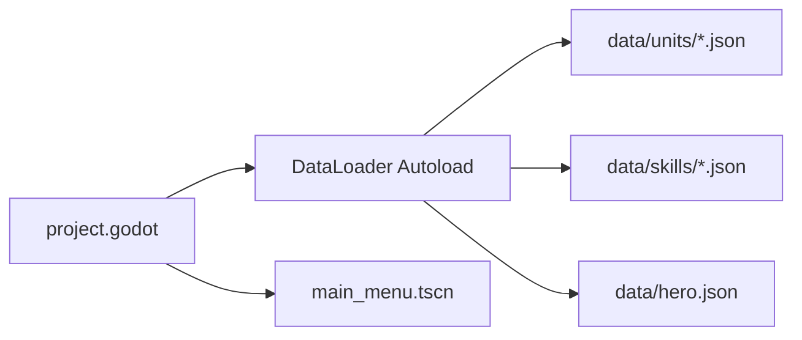
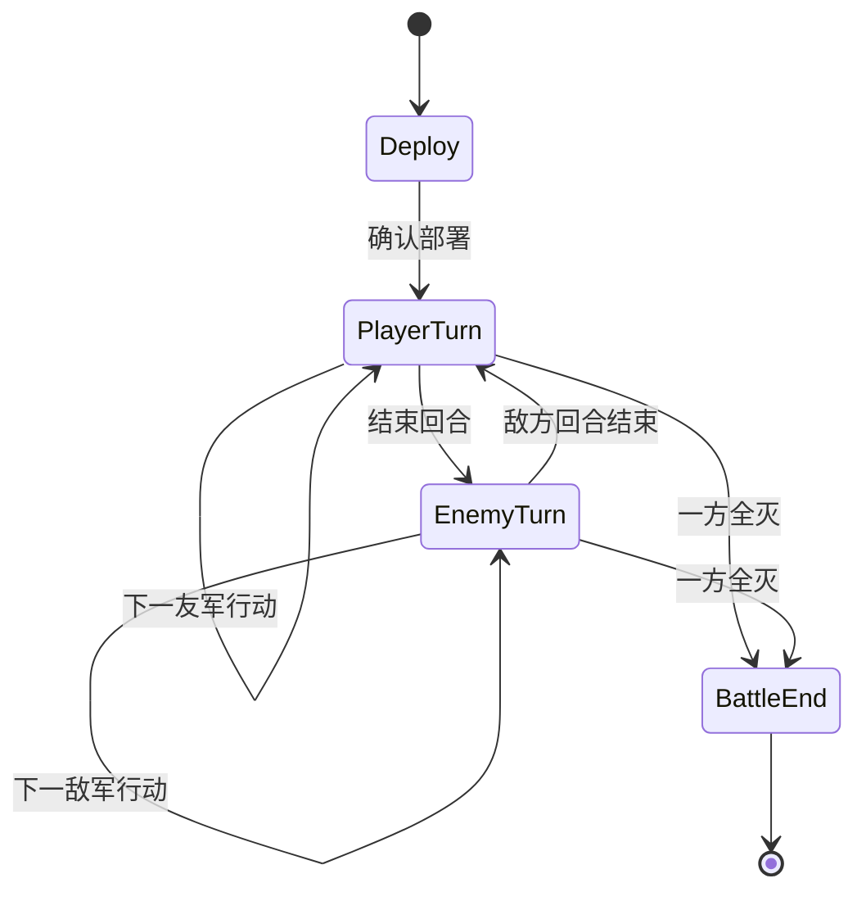
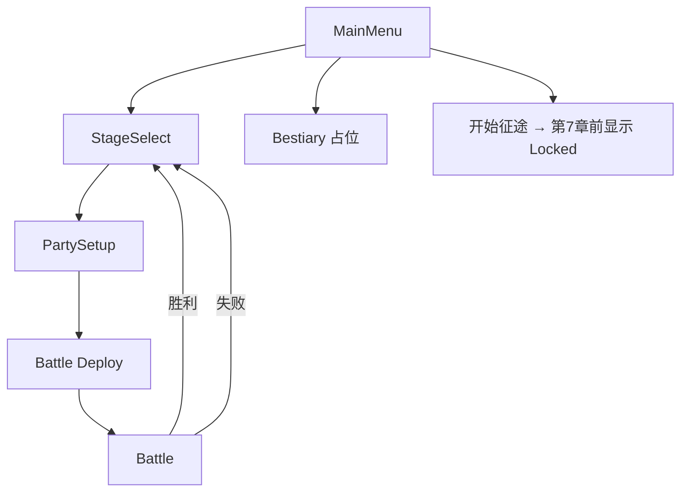
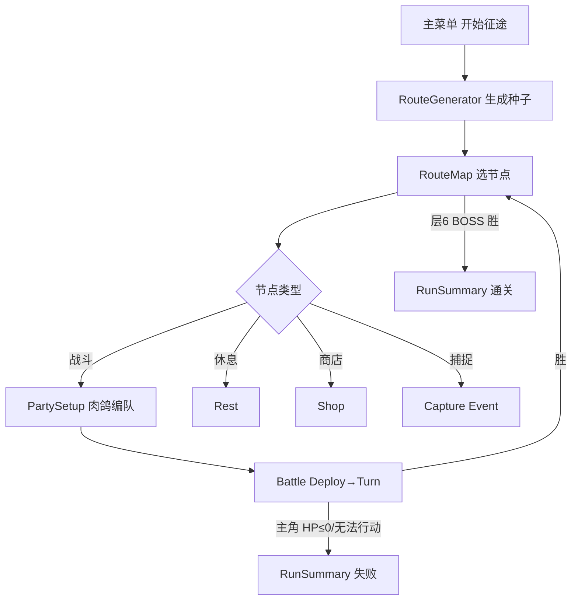
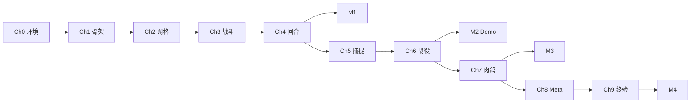

# 战棋捉宠 Demo — 完整实施计划

> **文档用途**：从零搭建 Godot 4 战棋捉宠 Demo 的**唯一主参考**。按章节顺序执行，每章含目标、交付物、文件清单、数据结构、验收清单、工时估算、Cursor Prompt 模板与界面线框。  
> **对齐设计稿**：[战棋捉宠游戏 MVP 完整方案（v2.0）](../战棋捉宠游戏_MVP完整方案.md) — 肉鸽主模式 + 战役教程。  
> **推荐代码项目路径**：`D:\develop\personal-games\tactics-monster\`  
> **版本**：Demo 实施计划 v1.0  
> **日期**：2026-06-16  
> **编码**：UTF-8 · 简体中文

---

## 目录

- [文档说明与里程碑总览](#文档说明与里程碑总览)
- [第 0 章 环境与工具链](#第-0-章-环境与工具链)
- [第 1 章 项目骨架与数据层](#第-1-章-项目骨架与数据层)
- [第 2 章 网格、地形与移动](#第-2-章-网格地形与移动)
- [第 3 章 战斗与克制](#第-3-章-战斗与克制)
- [第 4 章 回合、部署与敌方 AI](#第-4-章-回合部署与敌方-ai)
- [第 5 章 捕捉、备用栏与图鉴](#第-5-章-捕捉备用栏与图鉴)
- [第 6 章 战役模式与主菜单](#第-6-章-战役模式与主菜单)
- [第 7 章 肉鸽路线图与 Run 状态](#第-7-章-肉鸽路线图与-run-状态)
- [第 8 章 三选一奖励、Meta 解锁与打磨](#第-8-章-三选一奖励meta-解锁与打磨)
- [第 9 章 最终验收与发布准备](#第-9-章-最终验收与发布准备)
- [附录 A UI 线框汇总](#附录-a-ui-线框汇总)
- [附录 B Cursor Prompt 索引](#附录-b-cursor-prompt-索引)
- [附录 C 故障排查](#附录-c-故障排查)
- [附录 D 总工时与时间线表](#附录-d-总工时与时间线表)
- [附录 E MVP Phase ↔ Demo 章节对照](#附录-e-mvp-phase--demo-章节对照)

---

## 文档说明与里程碑总览

### 与设计稿的关系

本实施计划是 [战棋捉宠游戏_MVP完整方案.md](../战棋捉宠游戏_MVP完整方案.md) 的**可执行展开版**。设计稿定义「做什么」；本文定义「按什么顺序、改哪些文件、怎样验收」。若两者冲突，以设计稿 v2.0 的业务规则为准，本文补充工程细节。

### 实施顺序铁律

```
第 0～1 章（环境 + 骨架）
    ↓
第 2～4 章（共用战斗层：格点 → 战斗 → 回合/AI）
    ↓  ★ 里程碑 M1：能走能打
第 5 章（捕捉 + 图鉴）
    ↓
第 6 章（战役 + 主菜单 + 存档）
    ↓  ★ 里程碑 M2：战役 3 关可玩 Demo（给人看）
第 7 章（肉鸽路线图 + Run 状态）
    ↓  ★ 里程碑 M3：完整 Run 可走通（赢或输）
第 8～9 章（三选一 + Meta + 打磨 + 终验）
    ↓  ★ 里程碑 M4：MVP 全功能验收通过
```

**禁止**：在第 6 章完成前编写 `RouteGenerator`、路线图 UI 或 Run 存档逻辑。

### 里程碑定义

| 里程碑 | 完成章节 | 一句话标准 | 建议日期（业余节奏） |
|--------|----------|------------|----------------------|
| **M1** | 第 0～4 章 | 10×10 格上 1 场配置战从部署打到一方全灭 | 第 1～6 天 |
| **M2** | + 第 5～6 章 | 主菜单进战役，3 关打通，捕捉与进度存档正常 | 第 7～11 天 |
| **M3** | + 第 7 章 | 肉鸽从层 1 选节点到层 6 BOSS，失败/通关进结算 | 第 12～15 天 |
| **M4** | + 第 8～9 章 | 3 项 Meta 可解锁可感知，终验清单全绿 | 第 16～21 天 |

### 技术栈速查

| 层 | 选择 |
|----|------|
| 引擎 | Godot 4.3+ |
| 语言 | GDScript |
| 渲染 | 2D，TileMap 或 ColorRect 格点 |
| 数据 | JSON 驱动，放 `data/` |
| 存档 | **`user://save_meta.json`**（唯一持久文件：图鉴、Meta、统计、战役 `campaign`）；Run 状态仅内存 |
| 美术 | 色块 + 首字图标占位 |

---

## 第 0 章 环境与工具链

### 0.1 本章目标

- 安装并验证 Godot 4.3+ 与 Git
- 在独立目录创建空项目，配置版本控制
- 确认 Cursor 可打开 Godot 项目并运行 F5
- 建立与设计稿一致的目录约定

### 0.2 交付物

| 交付物 | 说明 |
|--------|------|
| Godot 4.3+ | 编辑器 + 导出模板（Windows 可选） |
| 空项目 | `D:\develop\personal-games\tactics-monster\project.godot` |
| `.gitignore` | 忽略 `.godot/`、`*.import` |
| `README.md`（可选） | 一行说明 + F5 运行方式 |

### 0.3 文件清单（本章新建/修改）

```
D:\develop\personal-games\tactics-monster\
├── project.godot
├── .gitignore
├── icon.svg
└── README.md                    # 可选
```

### 0.4 操作步骤

#### 0.4.1 安装 Godot

1. 访问 https://godotengine.org/download 下载 **Godot 4.3.x Standard**（非 .NET 版，除非团队约定 C#）
2. 解压到固定路径，例如 `C:\Tools\Godot\Godot_v4.3-stable_win64.exe`
3. 首次启动 → **Editor → Editor Settings → Text Editor → External** 可选配 VS Code/Cursor

#### 0.4.2 创建项目

1. Godot → **New Project**
2. Project Path：`D:\develop\personal-games\tactics-monster`
3. Renderer：**Forward+** 或 **Mobile**（2D 小品两者皆可；Mobile 启动略快）
4. 创建后 **Project → Project Settings**：
   - Application → Config → Name：`Tactics Monster`
   - Display → Window → Size：`1280×720`
   - Display → Window → Stretch → Mode：`canvas_items`，Aspect：`expand`

#### 0.4.3 Git 初始化

```powershell
Set-Location "D:\develop\personal-games\tactics-monster"
git init
```

`.gitignore` 内容：

```
.godot/
.import/
export_presets.cfg
*.translation
```

#### 0.4.4 验证运行

1. 默认场景 `main.tscn`（Godot 新建时会生成）→ F5
2. 窗口 1280×720 弹出即通过

### 0.4.5 Godot 编辑器 10 分钟入门

首次打开项目时，熟悉以下五个区域即可开始按章实施：

| 区域 | 位置 | 用途 |
|------|------|------|
| **Scene 树** | 左上 | 当前场景的节点层级；选中节点后可在 Inspector 改属性 |
| **Inspector** | 右上 | 选中节点的属性面板（位置、脚本、导出变量等） |
| **Viewport** | 中央 | 2D 场景预览与摆放 |
| **FileSystem** | 左下 | 项目文件树（`data/`、`scenes/`、`scripts/`） |
| **Output** | 底部 | F5 运行后的 `print()` 与报错信息 |

**Autoload**：`Project → Project Settings → Autoload` 注册全局单例（如 `DataLoader`）；启动时自动加载，任意脚本用 `/root/DataLoader` 访问。

**F5**：运行当前主场景（`main_scene`）；改代码后保存再 F5 即可验证。

**常用快捷键**：`Ctrl+S` 保存；`Ctrl+Shift+O` 快速打开场景；运行中 `F8` 暂停调试。

```
┌─ Godot 4 编辑器（简图）────────────────────────────────────┐
│ [Scene 树]     │  [Viewport 2D]          │ [Inspector]     │
│  └ MainMenu    │                           │  Node props     │
│ [FileSystem]   │                           │                 │
│  data/         ├───────────────────────────┤                 │
│  scenes/       │ [Output] print / errors   │                 │
└────────────────┴───────────────────────────┴─────────────────┘
  Project Settings → Autoload → DataLoader, SaveManager …
  [F5] 运行主场景
```

### 0.5 数据结构

本章无游戏数据结构。

### 0.6 验收清单

- [ ] `godot --version` 或编辑器 About 显示 4.3+
- [ ] 项目路径为 `D:\develop\personal-games\tactics-monster\`
- [ ] F5 无报错启动空场景
- [ ] Git 已 init，`.godot/` 未被跟踪
- [ ] Cursor 可打开该文件夹作为工作区

### 0.7 预估工时

| 任务 | 时间 |
|------|------|
| 下载安装 Godot | 0.5 h |
| 建项目 + Git | 0.5 h |
| **合计** | **~1 h** |

### 0.8 Cursor Prompt 模板

```
我要从零开始做 Godot 4 + GDScript 2D 战棋捉宠游戏（后续有肉鸽，现在只做环境）。

请帮我：
1. 确认项目路径 D:\develop\personal-games\tactics-monster\
2. 给出 project.godot 推荐 Display/Window 设置（1280×720）
3. 写 .gitignore（忽略 .godot/）
4. 不要写任何战斗、网格、菜单代码

验收：F5 能运行空主场景。
```

### 0.9 参考视图

```
┌─────────────────────────────────────┐
│  Godot Editor                       │
│  ┌─────────┬───────────────────────┐ │
│  │ Scene   │  Viewport (empty)     │ │
│  │ Dock    │                       │ │
│  └─────────┴───────────────────────┘ │
│  [F5 Play] → 1280×720 空窗口         │
└─────────────────────────────────────┘
```

---

## 第 1 章 项目骨架与数据层

### 1.1 本章目标

- 建立完整目录树（`data/`、`scenes/`、`scripts/`、`assets/`）
- 实现 Autoload：`GameState`、`DataLoader`、`SaveManager`（空壳 + 接口）
- 加载 8 种灵兽、技能、主角的 JSON 样板
- 主场景改为 `scenes/main_menu.tscn` 占位（单 Label 即可）

### 1.2 交付物

| 交付物 | 说明 |
|--------|------|
| 目录树 | 与设计稿 §7.2 一致 |
| `data_loader.gd` | 读取 JSON，提供 `get_unit(id)`、`get_skill(id)` |
| `data/skills/` | 技能 JSON ×10（§5.4）+ 主角用 `S_INSPIRE` |
| 单位 JSON ×8 + 技能 JSON + 主角 JSON | 字段与设计稿 §5 对齐；**八单位 skill_id 见设计稿 §5.5** |
| Autoload 注册 | Project Settings → Autoload 四项 |

### 1.3 文件清单

```
tactics-monster/
├── project.godot                 # 注册 Autoload、改 main_scene
├── data/
│   ├── units/
│   │   ├── M01_fire_fox.json
│   │   ├── M02_rock_turtle.json
│   │   ├── M03_wind_hawk.json
│   │   ├── M04_water_snake.json
│   │   ├── M05_thunder_deer.json
│   │   ├── M06_blade_leaf.json
│   │   ├── M07_shadow_bat.json
│   │   └── M08_baby_dragon.json
│   ├── skills/
│   │   ├── S_FIRE_CLAW.json
│   │   ├── S_ROCK_SHELL.json
│   │   ├── S_GUST.json
│   │   ├── S_INSPIRE.json
│   │   ├── S_AQUA_BITE.json
│   │   ├── S_THUNDER_CHARGE.json
│   │   ├── S_LEAF_SLASH.json
│   │   ├── S_SHADOW_DIVE.json
│   │   ├── S_DRAGON_BREATH.json
│   │   └── S_BERSERK.json
│   ├── hero.json
│   └── schema_notes.md           # 可选：字段说明
├── scripts/
│   └── autoload/
│       ├── game_state.gd
│       ├── data_loader.gd
│       ├── save_manager.gd
│       └── meta_manager.gd       # 空壳，第 8 章实现
├── scenes/
│   ├── main_menu.tscn
│   └── battle/
│       └── battle.tscn           # 空场景占位
└── assets/
    └── placeholder/
        └── README.txt
```

### 1.4 数据结构

#### 1.4.1 单位 JSON 示例（M01）

```json
{
  "id": "M01",
  "name": "火尾狐",
  "element": "fire",
  "weapon": "none",
  "unit_type": "foot",
  "rarity": "common",
  "base_capture_rate": 0.45,
  "stats": {
    "hp": 18,
    "atk": 7,
    "def": 3,
    "mov": 4
  },
  "skill_id": "S_FIRE_CLAW",
  "tags": ["starter_pool"]
}
```

#### 1.4.2 技能 JSON 示例

```json
{
  "id": "S_FIRE_CLAW",
  "name": "火爪",
  "effect_type": "damage_mult",
  "mult": 1.3,
  "cooldown": 2,
  "target": "single_enemy",
  "range": 1
}
```

#### 1.4.3 主角 hero.json

```json
{
  "id": "HERO",
  "name": "旅团新人",
  "weapon": "sword",
  "unit_type": "foot",
  "stats": { "hp": 25, "atk": 8, "def": 4, "mov": 4 },
  "skill_id": "S_INSPIRE"
}
```

#### 1.4.4 八单位 skill_id（与 [MVP §5.5](../战棋捉宠游戏_MVP完整方案.md) 一致）

| 单位 | skill_id | 技能 |
|------|----------|------|
| M01 | S_FIRE_CLAW | 火爪 |
| M02 | S_ROCK_SHELL | 岩盾 |
| M03 | S_GUST | 疾风 |
| M04 | S_AQUA_BITE | 水噬 |
| M05 | S_THUNDER_CHARGE | 雷冲 |
| M06 | S_LEAF_SLASH | 叶斩 |
| M07 | S_SHADOW_DIVE | 影袭 |
| M08 | S_DRAGON_BREATH | 龙息 |

#### 1.4.5 DataLoader 接口（GDScript 签名）

```gdscript
# scripts/autoload/data_loader.gd
func load_all() -> void
func get_unit(unit_id: String) -> Dictionary
func get_skill(skill_id: String) -> Dictionary
func get_hero() -> Dictionary
func get_all_unit_ids() -> Array[String]
```

#### 1.4.6 GameState 枚举（预留）

```gdscript
enum GameMode { NONE, CAMPAIGN, ROGUELIKE }
enum BattlePhase { DEPLOY, PLAYER_TURN, ENEMY_TURN, RESOLVE, END }
```

### 1.5 验收清单

- [ ] 目录树与 §1.3 一致（允许文件名微调）
- [ ] F5 进入 `main_menu.tscn`，显示占位文字
- [ ] 启动时 `DataLoader.load_all()` 无报错
- [ ] 调试打印 `DataLoader.get_unit("M01")` 含 `name`=`火尾狐`
- [ ] 8 单位 + 技能 JSON 均可解析（skill_id 与 [MVP §5.5](../战棋捉宠游戏_MVP完整方案.md#55-八单位-skill_id-对照m01m08) 一致）
- [ ] Autoload 顺序：`DataLoader` → `GameState` → `SaveManager` → `MetaManager`

### 1.6 预估工时

| 任务 | 时间 |
|------|------|
| 目录 + Autoload 空壳 | 2 h |
| 编写 8 单位 + 10 技能 JSON | 2 h |
| DataLoader 实现 | 2 h |
| **合计** | **~6 h（1 天）** |

### 1.7 Cursor Prompt 模板

```
Phase 0 环境已完成。现在做 Phase 1：项目骨架与数据层。

项目路径：D:\develop\personal-games\tactics-monster\

请创建：
1. data/units/ 下 8 个灵兽 JSON（字段对齐 MVP 方案 §5.1）
2. data/skills/ 下技能 JSON（§5.4 全表 + BOSS 用 S_BERSERK）
3. 8 个灵兽 JSON 的 skill_id 对齐 MVP §5.5
4. data/hero.json
5. scripts/autoload/data_loader.gd — 启动时 load_all，提供 get_unit/get_skill/get_hero
6. game_state.gd、save_manager.gd、meta_manager.gd 空壳
7. scenes/main_menu.tscn 占位，设为 main_scene

不要写：网格、战斗、捕捉、肉鸽、战役关卡。
验收：F5 启动，控制台打印 M01 名称。
```

### 1.8 参考视图



---

## 第 2 章 网格、地形与移动

### 2.1 本章目标

- 10×10 整数格战场，坐标 `(x,y)` 左上为 `(0,0)`
- 四种地形：平原、森林、山地、水域（含移动/防御修正）
- 单位占格、墙不可通行
- BFS 可达范围高亮；点击合法格移动
- **不含**攻击、回合、菜单

### 2.2 交付物

| 交付物 | 说明 |
|--------|------|
| `grid.gd` | 格点逻辑、地形查询、占格表 |
| `pathfinding.gd` | BFS，考虑 MOV、山地 -1、墙、占格 |
| `battle.tscn` | 网格可视化 + 1 测试单位 |
| `terrain_types.gd` | 地形常量与修正函数 |
| 测试地图 | 硬编码或 `data/map_templates/test_grid.json` |

### 2.3 文件清单

```
scripts/battle/
├── grid.gd
├── pathfinding.gd
├── terrain_types.gd
└── unit_view.gd              # 单位精灵/ColorRect + 格坐标
scenes/battle/
├── battle.tscn
└── tile_cell.tscn            # 单格 ColorRect 可选
data/map_templates/
└── test_grid.json
```

### 2.4 数据结构

#### 2.4.1 地形枚举

```gdscript
# terrain_types.gd
const PLAIN  = 0   # 无加成
const FOREST = 1   # def +1
const MOUNT  = 2   # mov_cost +1, def +1
const WATER  = 3   # 步行不可进；飞行可
const WALL   = 4   # 不可通行
```

#### 2.4.2 test_grid.json

```json
{
  "id": "TEST",
  "width": 10,
  "height": 10,
  "terrain": [
    [0,0,0,0,0,0,0,0,0,0],
    [0,1,1,0,2,2,0,1,0,0],
    [0,1,0,0,2,0,0,0,3,3],
    [0,0,0,4,4,0,0,0,3,3],
    [0,0,0,0,0,0,0,0,0,0],
    [0,2,2,0,0,0,1,1,0,0],
    [0,0,0,0,0,0,1,0,0,0],
    [0,0,3,3,0,0,0,0,0,0],
    [0,0,3,3,0,0,0,2,2,0],
    [0,0,0,0,0,0,0,0,0,0]
  ],
  "deploy_zones": {
    "player": [{"x":0,"y":4},{"x":0,"y":5},{"x":1,"y":4},{"x":1,"y":5}],
    "enemy": [{"x":9,"y":4},{"x":9,"y":5}]
  }
}
```

#### 2.4.3 Grid 核心 API

```gdscript
class_name Grid
var width: int = 10
var height: int = 10
var terrain: Array                  # 2D int
var occupancy: Dictionary           # Vector2i -> unit_id

func get_terrain(pos: Vector2i) -> int
func is_walkable(pos: Vector2i, unit_type: String) -> bool
func set_occupant(pos: Vector2i, unit_id: String) -> void
func clear_occupant(pos: Vector2i) -> void
func get_move_cost(from: Vector2i, to: Vector2i, unit_type: String) -> int
```

#### 2.4.4 Pathfinding

```gdscript
func get_reachable(grid: Grid, start: Vector2i, mov: int, unit_type: String) -> Array[Vector2i]
func find_path(grid: Grid, start: Vector2i, goal: Vector2i, mov: int, unit_type: String) -> Array[Vector2i]
```

### 2.5 交互流程（本章）

```
点击测试单位 → 高亮可达格（半透明蓝）
点击可达格   → 单位 tween 移动，更新 occupancy
点击不可达格 → 忽略或轻提示
```

### 2.6 验收清单

- [ ] 地图 10×10 正确渲染（色块：浅绿/深绿/灰褐/蓝/黑墙）
- [ ] 步行单位不能进入水域
- [ ] 飞行单位（临时改 unit_type 测）可进水域
- [ ] 山地移动消耗正确（同样 MOV 下比平原少走格）
- [ ] 墙不可进入；两单位不能同格
- [ ] BFS 可达范围与手动验证 3 个角例一致
- [ ] **仍无**攻击、HP、回合按钮

### 2.7 预估工时

| 任务 | 时间 |
|------|------|
| Grid + 地形 | 4 h |
| Pathfinding | 3 h |
| battle.tscn 可视化 + 点击 | 4 h |
| **合计** | **~11 h（1.5～2 天）** |

### 2.8 Cursor Prompt 模板

```
Phase 1 数据层已完成。现在只做 Phase 2：网格与移动。

项目：D:\develop\personal-games\tactics-monster\

需求：
- 10×10 格，四种地形 + 墙，规则对齐 MVP §4.1~4.2
- scripts/battle/grid.gd、pathfinding.gd、terrain_types.gd
- scenes/battle/battle.tscn：色块渲染，1 个测试单位
- data/map_templates/test_grid.json
- 点击单位 → 高亮可达 → 点击移动

不要：战斗、HP、回合、捕捉、菜单、肉鸽。
验收：测试单位在复杂地形上移动正确，飞行可过水。
```

### 2.9 参考视图

```
Battle 测试场景（俯视图 ASCII）

    0   1   2   3   4   5   6   7   8   9
  ┌───┬───┬───┬───┬───┬───┬───┬───┬───┬───┐
0 │ . │ . │ . │ . │ . │ . │ . │ . │ . │ . │
1 │ . │ # │ # │ . │ ^ │ ^ │ . │ # │ . │ . │  .=平原 #=森林 ^=山
2 │ . │ # │ . │ . │ ^ │ . │ . │ . │ ~ │ ~ │  ~=水
3 │ . │ . │ . │ X │ X │ . │ . │ . │ ~ │ ~ │  X=墙
4 │ . │ . │ . │ . │ . │ . │ . │ . │ . │ . │
5 │ . │ . │ . │ . │ . │ . │ . │ . │ . │ . │
6 │ . │ ^ │ ^ │ . │ . │ . │ # │ # │ . │ . │
7 │ . │ . │ . │ . │ . │ . │ # │ . │ . │ . │
8 │ . │ . │ ~ │ ~ │ . │ . │ . │ . │ . │ . │
9 │ . │ . │ ~ │ ~ │ . │ . │ . │ ^ │ ^ │ . │
  └───┴───┴───┴───┴───┴───┴───┴───┴───┴───┘

  [@] = 测试单位（例如 x=1,y=4）
  高亮格 = 当前 MOV 可达范围
```

---

## 第 3 章 战斗与克制

### 3.1 本章目标

- 实现伤害公式（攻击、防御、克制、技能系数、地形防御）
- 近战 1 格 / 远程 2～3 格攻击范围
- 单位 HP 归零 → 死亡/移除
- 胜负判定：一方全灭
- 仍可在「自由测试模式」下操作，**完整回合流程在第 4 章**

### 3.2 交付物

| 交付物 | 说明 |
|--------|------|
| `combat_calc.gd` | 纯函数伤害计算 |
| `battle_unit.gd` | 运行时单位：stats、hp、weapon、skill_cd |
| `battle_controller.gd` | 攻击流程、死亡处理 |
| 攻击范围高亮 + 目标选择 UI | 按钮或点击敌人 |

### 3.3 文件清单

```
scripts/battle/
├── combat_calc.gd
├── battle_unit.gd
├── battle_controller.gd
└── weapon_triangle.gd        # 剑→斧→枪→剑
scenes/battle/
├── battle.tscn               # 扩展：2 单位对战
└── ui/
    └── action_bar.tscn       # 占位：攻击/待机
```

### 3.4 数据结构

#### 3.4.1 克制表

```gdscript
# weapon_triangle.gd
const TRIANGLE = {
  "sword": "axe",
  "axe": "spear",
  "spear": "sword"
}
func get_multiplier(attacker_weapon: String, defender_weapon: String) -> float:
    # 克制 1.2 / 被克 0.8 / 无关 1.0 / none 按 1.0
```

#### 3.4.2 BattleUnit 运行时

```gdscript
class_name BattleUnit
var unit_id: String
var template_id: String       # M01 or HERO
var is_player: bool
var grid_pos: Vector2i
var hp: int
var max_hp: int
var atk: int
var def: int
var mov: int
var weapon: String
var unit_type: String
var skill_id: String
var skill_cooldown_left: int = 0
var buffs: Array = []
```

#### 3.4.3 伤害公式（与设计稿一致）

```
final_damage = max(1, (atk - def) * weapon_mult * skill_mult) + terrain_def_bonus
```

- `terrain_def_bonus`：防守方在森林 +1 有效防御（或等价减伤，实现时二选一但全文统一）
- 技能：`S_FIRE_CLAW` → skill_mult = 1.3，CD 2

#### 3.4.4 胜负

```gdscript
func check_victory(units: Array[BattleUnit]) -> String:
    # 返回 "player" | "enemy" | "none"
```

### 3.5 验收清单

- [ ] 剑打斧伤害 ×1.2，斧打剑 ×0.8
- [ ] 森林上防守单位更耐打（可测）
- [ ] 远程单位（M03）可隔 1 格攻击
- [ ] HP≤0 单位从网格移除
- [ ] 2v2 配置下全灭一方弹出「Player Win / Enemy Win」调试文本
- [ ] 技能使用后进入 CD，CD 内不可用
- [ ] **尚无**完整回合轮换（可手动切换操作方测试）

### 3.6 预估工时

| 任务 | 时间 |
|------|------|
| combat_calc + weapon | 3 h |
| battle_unit + controller | 4 h |
| 攻击 UI + 范围 | 4 h |
| **合计** | **~11 h（1.5～2 天）** |

### 3.7 Cursor Prompt 模板

```
Phase 2 网格移动已完成。现在做 Phase 3：战斗与克制。

项目：D:\develop\personal-games\tactics-monster\

需求对齐 MVP §4.3~4.4：
- combat_calc.gd 伤害公式
- weapon_triangle 剑斧枪克制
- battle_unit.gd 运行时属性
- battle.tscn 放 2 个玩家 + 2 个敌人，可选手动切换操作
- 攻击范围、技能 CD、死亡移除、胜负判定

不要：完整回合机、AI、部署、捕捉、菜单。
验收：2v2 互殴至一方全灭，克制伤害可肉眼区分。
```

### 3.8 参考视图

```
┌──────────────────────────────────────────────┐
│ Turn: -- (manual)     [测试模式]              │
├──────────────────────────────────────────────┤
│                                              │
│            [ 10×10 战场 ]                     │
│                                              │
│     火尾狐 HP 12/18    敌狼 HP 0/15 ✗        │
├──────────────────────────────────────────────┤
│ 选中: 旅团新人  HP 25/25                      │
│ [移动] [攻击] [技能] [待机]                    │
└──────────────────────────────────────────────┘
```

---

## 第 4 章 回合、部署与敌方 AI

### 4.1 本章目标

- **部署阶段**：玩家在地图边缘指定区放置最多 4 单位（测试阶段 1 主角 + 配置敌人）
- **回合制**：玩家全体行动 → 结束回合 → 敌方 AI 全体行动 → 循环
- 敌方 AI：范围内打 HP 最低；否则向最近玩家移动
- BOSS 行为预留：HP<50% 用技能（可先写接口）
- 接入 `turn_manager.gd` 状态机

### 4.2 交付物

| 交付物 | 说明 |
|--------|------|
| `turn_manager.gd` | DEPLOY → PLAYER → ENEMY → CHECK_END |
| `deploy_phase.gd` | 拖拽或点击放置 |
| `enemy_ai.gd` | 决策：攻击 / 移动 / 待机 |
| `battle_scene.gd` | 总控，接 TurnManager |
| 1 个完整 `data/stages/debug_battle.json` | 用于验收一场完整战斗 |

### 4.3 文件清单

```
scripts/battle/
├── turn_manager.gd
├── deploy_phase.gd
├── enemy_ai.gd
└── battle_scene.gd
data/stages/
└── debug_battle.json
scenes/battle/
├── battle.tscn
└── ui/
    ├── action_bar.tscn
    └── turn_banner.tscn
```

### 4.4 数据结构

#### 4.4.1 debug_battle.json

```json
{
  "id": "DEBUG_01",
  "map_template": "test_grid",
  "player_units": [
    { "template": "HERO", "deploy_index": 0 }
  ],
  "enemy_units": [
    { "template": "M01", "spawn": {"x": 8, "y": 4} },
    { "template": "M02", "spawn": {"x": 8, "y": 5} }
  ],
  "win_condition": "annihilate",
  "player_ball_count": 3
}
```

#### 4.4.2 TurnManager 状态

```gdscript
enum TurnPhase { DEPLOY, PLAYER_TURN, ENEMY_TURN, BATTLE_END }
var current_phase: TurnPhase
var round_number: int = 1
var active_unit: BattleUnit = null
var player_queue: Array[BattleUnit] = []
var enemy_queue: Array[BattleUnit] = []
```

#### 4.4.3 Enemy AI 伪代码

```
for each enemy in speed_order:
  if any player in attack_range:
    target = lowest_hp(player in range)
    attack(target)
  else:
    move toward nearest_player (max mov)
  end turn
```

### 4.5 交互流程



### 4.6 验收清单

- [ ] 部署阶段只能放在 `deploy_zones.player`
- [ ] 玩家回合可依次操作全部友军，「结束回合」后不可再动
- [ ] 敌方自动攻击 HP 最低目标（可录屏验证）
- [ ] 敌方会走向最近玩家
- [ ] 回合数递增显示
- [ ] `debug_battle.json` 从头打到胜/负无卡死
- [ ] ★ **里程碑 M1 达成**

### 4.7 预估工时

| 任务 | 时间 |
|------|------|
| TurnManager | 4 h |
| Deploy | 3 h |
| Enemy AI | 4 h |
| 整合 + debug stage | 4 h |
| **合计** | **~15 h（2 天）** |

### 4.8 Cursor Prompt 模板

```
Phase 3 战斗已完成。现在做 Phase 4：回合、部署、敌方 AI。

项目：D:\develop\personal-games\tactics-monster\

需求：
- turn_manager.gd：DEPLOY → PLAYER_TURN → ENEMY_TURN
- deploy_phase：边缘指定区放置单位
- enemy_ai：范围内最低 HP；否则向最近玩家移动
- data/stages/debug_battle.json 验收关卡
- action_bar 增加「结束回合」

不要：捕捉、战役、主菜单、肉鸽。
验收：debug_battle 从头打到胜利或失败，AI 行为正确。
```

### 4.9 参考视图

```
┌─ Deploy Phase ─────────────────────────────┐
│ 放置区（左缘）：                            │
│  [HERO]  [空]  [空]  [空]   ← 拖拽到地图    │
│           [确认部署]                        │
└────────────────────────────────────────────┘

┌─ Player Turn — Round 2 ────────────────────┐
│ 当前行动: 旅团新人                           │
│ [移动][攻击][技能][待机]     [结束回合]      │
└────────────────────────────────────────────┘
```

---

## 第 5 章 捕捉、备用栏与图鉴

### 5.1 本章目标

- 野生单位击倒后进入「可捕捉」状态（HP≤30%、相邻 1 格）
- 捕捉成功率公式 + UI 档位（高/中/低/极低）
- 消耗捕捉球；成功入备用栏，失败仍消耗
- 图鉴：见过=发现，捕获=完成；写入 `save_meta.json`
- 出战编制与备用栏上限（战役 12 / 肉鸽 Run 8，本章先实现逻辑常量）

### 5.2 交付物

| 交付物 | 说明 |
|--------|------|
| `capture_system.gd` | 条件检查 + 概率 roll |
| `capture_prompt.tscn` | 捕捉确认 UI |
| `bestiary_manager.gd` | 发现/完成状态 |
| `party_manager.gd` | 出战 4 + 备用栏 |
| SaveManager 写入 bestiary | 持久化 |

### 5.3 文件清单

```
scripts/battle/
├── capture_system.gd
└── party_manager.gd
scripts/autoload/
├── save_manager.gd           # 扩展 bestiary 读写
└── bestiary_manager.gd       # 或在 save_manager 内
scenes/battle/ui/
├── capture_prompt.tscn
└── capture_rate_label.tscn
data/
└── capture_config.json       # hp_factor、rarity_factor
```

### 5.4 数据结构

#### 5.4.1 capture_config.json

```json
{
  "hp_factors": [
    { "min_pct": 0.5, "max_pct": 1.0, "factor": 0, "capturable": false },
    { "min_pct": 0.3, "max_pct": 0.5, "factor": 0.5, "capturable": true },
    { "min_pct": 0.1, "max_pct": 0.3, "factor": 1.0, "capturable": true },
    { "min_pct": 0.0, "max_pct": 0.1, "factor": 1.5, "capturable": true }
  ],
  "rarity_factors": {
    "common": 1.0,
    "rare": 0.6,
    "boss": 0.3
  },
  "event_bonus_default": 1.0,
  "event_bonus_capture_node": 1.5
}
```

#### 5.4.2 捕捉率计算

```gdscript
func calc_capture_rate(unit: BattleUnit, base_rate: float, event_bonus: float) -> float:
    var hp_factor = _hp_factor(unit.hp, unit.max_hp)
    var rarity_factor = _rarity_factor(unit.template_id)
    return base_rate * hp_factor * rarity_factor * event_bonus

func rate_tier(rate: float) -> String:
    # >=0.5 高, >=0.25 中, >=0.12 低, else 极低
```

#### 5.4.3 user://save_meta.json（图鉴 + 战役 + Meta，唯一持久文件）

路径固定为 **`user://save_meta.json`**。不使用 `meta_save.json`、`save_campaign.json` 等分文件；战役进度写在 `campaign` 字段内。

```json
{
  "bestiary": {
    "M01": "caught",
    "M02": "seen",
    "M03": "unknown"
  },
  "meta_unlocked": [],
  "stats": {},
  "campaign": {}
}
```

#### 5.4.4 PartyManager

```gdscript
const MAX_DEPLOY = 4
const MAX_RESERVE_CAMPAIGN = 12
const MAX_RESERVE_ROGUELIKE = 8

var deploy_list: Array[String]    # unit instance ids
var reserve_list: Array[String]
func add_to_reserve(template_id: String) -> bool
func can_capture() -> bool        # balls > 0
```

### 5.5 UI 流程

```
野生单位 HP≤30% 被击倒 → 格上显示「可捕捉」图标
玩家单位相邻 → 点击 [捕捉]
  → 弹窗：成功率档位「中」、剩余球 3
  → [确认] roll → 成功/失败动画
成功 → 备用栏 + 图鉴 caught
失败 → 球 -1
```

### 5.6 验收清单

- [ ] HP>30% 不可捕；相邻远格不可捕
- [ ] 成功率档位 UI 与公式大致对应
- [ ] 成功捕获 M01 后图鉴点亮「完成」
- [ ] 仅见过未捕显示「发现」
- [ ] 球耗尽后捕捉按钮灰显
- [ ] 备用栏满时提示替换或放弃（简版二选一即可）
- [ ] 重启游戏图鉴状态保留

### 5.7 预估工时

| 任务 | 时间 |
|------|------|
| capture_system | 4 h |
| UI + 战斗接入 | 4 h |
| bestiary + save | 3 h |
| party_manager | 3 h |
| **合计** | **~14 h（2 天）** |

### 5.8 Cursor Prompt 模板

```
Phase 4 回合 AI 已完成。现在做 Phase 5：捕捉与图鉴。

项目：D:\develop\personal-games\tactics-monster\

需求对齐 MVP §4.5~4.6：
- capture_system.gd + capture_config.json
- 捕捉条件、概率、档位 UI
- 捕捉球消耗；备用栏
- bestiary 写入 user://save_meta.json
- action_bar 增加 [捕捉]

不要：战役选关、主菜单、肉鸽。
验收：debug 关击倒 M01 并捕获，重启后图鉴仍为 caught。
```

### 5.9 参考视图

```
┌─ Capture Prompt ─────────────────────────────┐
│  目标: 火尾狐  HP 4/18 (22%)                 │
│  成功率: ●●●○  [中]                         │
│  剩余捕捉球: 2                               │
│         [确认捕捉]  [取消]                   │
└────────────────────────────────────────────┘
```

---

## 第 6 章 战役模式与主菜单

### 6.1 本章目标

- 主菜单：开始征途（占位禁用或提示）、战役、图鉴、选项
- 战役 3 关固定数据 + 选关 UI
- 战役编队：主角 + 已捕获灵兽
- 通关/失败回选关；战役进度存档
- **完成本章 = 可展示 Demo** → ★ **里程碑 M2**

### 6.2 交付物

| 交付物 | 说明 |
|--------|------|
| `main_menu.tscn` | 四按钮导航 |
| `stage_select.tscn` | 3 关卡片 + 锁/通状态 |
| `party_setup.tscn` | 战役编队 |
| `data/stages/stage_01~03.json` | 与设计稿 §5.3 一致 |
| `campaign_manager.gd` | 进度、解锁下一关 |
| Battle 入口参数化 | `GameState.start_battle(mode, stage_id)` |

### 6.3 文件清单

```
scenes/
├── main_menu.tscn
├── campaign/
│   ├── stage_select.tscn
│   └── party_setup.tscn
scripts/
├── campaign/
│   └── campaign_manager.gd
data/stages/
├── stage_01_border_plain.json
├── stage_02_wet_edge.json
└── stage_03_old_fort_boss.json
data/units/
└── BOSS_MERC.json
scripts/autoload/
└── game_state.gd              # 扩展 mode / battle_context
```

### 6.4 数据结构

#### 6.4.1 stage_01 示例

```json
{
  "id": "stage_01",
  "name": "边境草原",
  "map_template": "T_PLAIN",
  "tutorial_hints": ["移动", "攻击", "克制", "捕捉"],
  "player": {
    "deploy_max": 4,
    "balls": 3,
    "allowed_units": "campaign_party"
  },
  "enemies": [
    { "template": "M01", "spawn": {"x": 7, "y": 3} },
    { "template": "M01", "spawn": {"x": 7, "y": 6} },
    { "template": "M02", "spawn": {"x": 8, "y": 4} }
  ],
  "unlock_next": "stage_02"
}
```

#### 6.4.2 地图模板 T_PLAIN（节选）

```json
{
  "id": "T_PLAIN",
  "width": 10,
  "height": 10,
  "terrain": "..." ,
  "deploy_zones": { "player": [...], "enemy": [...] }
}
```

需同步创建 `T_PLAIN`、`T_WET`、`T_FORT` 至少 3 张（肉鸽第 7 章再补全 5 张）。

#### 6.4.3 campaign 存档

```json
"campaign": {
  "stage_01": "cleared",
  "stage_02": "unlocked",
  "stage_03": "locked"
}
```

#### 6.4.4 GameState 战斗上下文

```gdscript
var current_mode: GameMode
var stage_id: String
var battle_result_callback: Callable

func start_campaign_battle(stage_id: String) -> void
func start_roguelike_battle(node_context: Dictionary) -> void  # 第 7 章实现
```

### 6.5 场景流程



### 6.6 三关设计要点（与设计稿对齐）

| 关卡 | 地图 | 敌人 | 教学重点 |
|------|------|------|----------|
| stage_01 | 草原 T_PLAIN | 2×M01 + 1×M02 | 移动、攻击、克制、捕捉 |
| stage_02 | 湿地 T_WET | M03,M04,M06 + 增援 M01 | 飞行、枪克骑 |
| stage_03 | 要塞 T_FORT | BOSS 佣兵 + 2 小怪 + 低概率 M08 | 完整战术、稀有捕捉 |

**BOSS 佣兵**：使用 `data/units/BOSS_MERC.json`（数值对齐 [MVP §5.3 BOSS_MERC](../战棋捉宠游戏_MVP完整方案.md)）。

#### 6.4.5 BOSS_MERC.json 示例

```json
{
  "id": "BOSS_MERC",
  "name": "堡主佣兵",
  "element": "none",
  "weapon": "axe",
  "unit_type": "heavy",
  "rarity": "boss",
  "capturable": false,
  "stats": {
    "hp": 45,
    "atk": 12,
    "def": 8,
    "mov": 3
  },
  "skill_id": "S_BERSERK",
  "ai_profile": "boss_default",
  "tags": ["stage_03_boss", "layer_6_boss"]
}
```

`ai_profile: boss_default` → 攻击 HP 最低目标；自身 HP<50% 时使用一次 `S_BERSERK`（见 `enemy_ai.gd`）。

### 6.7 验收清单

- [ ] 主菜单可进战役、图鉴（图鉴只读展示 8 格）
- [ ] 初始仅 stage_01 解锁
- [ ] 编队可选已捕获灵兽出战（最多 4）
- [ ] 3 关均可进入战斗并返回
- [ ] 通关 stage_01 解锁 stage_02，以此类推
- [ ] 战役失败不丢灵兽/图鉴
- [ ] 进度写入 `user://save_meta.json` 重启保留
- [ ] 「开始征途」可先灰显或弹「第 7 章启用」
- [ ] ★ **里程碑 M2 达成**

### 6.8 预估工时

| 任务 | 时间 |
|------|------|
| 3 关 JSON + 3 地图模板 | 6 h |
| main_menu + stage_select | 4 h |
| party_setup | 4 h |
| campaign_manager + 存档 | 4 h |
| Battle 接入 campaign | 4 h |
| **合计** | **~22 h（3 天）** |

### 6.9 Cursor Prompt 模板

```
Phase 5 捕捉已完成。现在做 Phase 6：战役 + 主菜单。

项目：D:\develop\personal-games\tactics-monster\

需求对齐 MVP §5.3、§6.1：
- main_menu：战役、图鉴、开始征途(禁用)
- stage_select 3 关 + campaign 进度
- party_setup 战役编队
- data/stages/stage_01~03.json + map_templates T_PLAIN/T_WET/T_FORT
- 战斗胜利/失败回 stage_select，进度写 user://save_meta.json

不要：肉鸽路线图、RunState、Meta 解锁。
验收：新档打通 3 关，重启进度仍在。
```

### 6.10 参考视图

```
┌─ Main Menu ──────────────────────────────────┐
│           战棋捉宠 Demo                     │
│                                              │
│         [ 开始征途 ]  (锁定)                  │
│         [ 战  役   ]                          │
│         [ 图  鉴   ]                          │
│         [ 设  置   ]                          │
└──────────────────────────────────────────────┘

┌─ Stage Select ───────────────────────────────┐
│  ┌─────────┐ ┌─────────┐ ┌─────────┐        │
│  │ 关1 ★★★ │ │ 关2 ★☆☆ │ │ 关3 🔒  │        │
│  │边境草原 │ │湿地边缘 │ │旧堡BOSS │        │
│  └─────────┘ └─────────┘ └─────────┘        │
│                              [编队] [返回]   │
└──────────────────────────────────────────────┘
```

---

## 第 7 章 肉鸽路线图与 Run 状态

### 7.1 本章目标

- `RunState`：层数、路线、队伍、球、币、已完成节点
- `RouteGenerator`：6 层，每层 2～3 选 1，层 6 固定 BOSS
- 路线图 UI：竖向节点、侧边栏状态
- 节点类型：普通战 / 精英 / 休息 / 商店 / 捕捉事件 / BOSS
- 5 地图模板 + 敌组表随机；战斗接 Battle
- Run 失败（**主角 HP≤0 或主角无法行动**）→ `run_summary`；备用栏/出战灵兽阵亡 **不** 结束 Run
- BOSS 胜 → 通关结算
- **里程碑 M3**

### 7.2 交付物

| 交付物 | 说明 |
|--------|------|
| `run_state.gd` | 本 Run 内存状态 |
| `route_generator.gd` | 种子随机生成路线 |
| `route_map.tscn` | 路线图 UI |
| `shop.tscn` / `rest.tscn` | 商店、休息（简版） |
| `run_summary.tscn` | 结算 |
| `data/route/layer_pools.json` | 层池配置 |
| `data/enemy_groups/` | 按层加权敌组 |
| 补全 `T_FOREST`、`T_MIX` 地图模板 | 共 5 张 |

### 7.3 文件清单

```
scripts/roguelike/
├── run_state.gd
├── route_generator.gd
├── node_handlers.gd            # 各节点类型进入逻辑
└── enemy_group_picker.gd
scenes/roguelike/
├── route_map.tscn
├── shop.tscn
├── rest.tscn
├── capture_event.tscn
└── run_summary.tscn
data/route/
├── layer_pools.json
└── node_types.json
data/enemy_groups/
├── layer_1_2_normal.json
├── layer_3_4_normal.json
├── layer_3_4_elite.json
├── layer_5_elite.json
└── layer_6_boss.json
data/map_templates/
├── T_PLAIN.json
├── T_FOREST.json
├── T_WET.json
├── T_FORT.json
└── T_MIX.json
```

### 7.4 数据结构

#### 7.4.1 RunState

```gdscript
class_name RunState
var seed: int
var current_layer: int = 1
var route_graph: Array       # 每层节点选项 [{id,type,connections}]
var selected_path: Array     # 已选节点 id
var party: Array             # BattleUnit 序列化
var reserve: Array
var balls: int = 3
var coins: int = 0
var hero_dead: bool = false

func serialize() -> Dictionary
static func deserialize(d: Dictionary) -> RunState
```

#### 7.4.2 layer_pools.json（与设计稿一致）

```json
{
  "layers": [
    { "layer": 1, "pool": ["battle", "battle", "capture_event"], "pick_count": 2, "choose": 1 },
    { "layer": 2, "pool": ["battle", "rest"], "pick_count": 2, "choose": 1 },
    { "layer": 3, "pool": ["battle", "elite", "shop"], "pick_count": 3, "choose": 1 },
    { "layer": 4, "pool": ["battle", "capture_event"], "pick_count": 2, "choose": 1 },
    { "layer": 5, "pool": ["rest", "elite", "battle"], "pick_count": 3, "choose": 1 },
    { "layer": 6, "pool": ["boss"], "pick_count": 1, "choose": 1 }
  ],
  "constraints": [
    { "rule": "layer_3_or_5_has_elite_or_shop" },
    { "rule": "layer_6_always_boss" }
  ]
}
```

#### 7.4.3 节点类型 → 行为

| type | 进入后 |
|------|--------|
| battle | 随机 map + layer 敌组，普通战 |
| elite | 精英敌组，胜后标记待三选一（第 8 章） |
| rest | 全员 +30% HP 或弃 1 宠换满血 |
| shop | 3 商品槽，征途币购买 |
| capture_event | 高捕获率遭遇 1～2 指定系 |
| boss | BOSS 敌组，胜后 Run 胜利 |

#### 7.4.4 敌组 picker

```gdscript
func pick_group(layer: int, is_elite: bool, rng: RandomNumberGenerator) -> Dictionary:
    # 返回 { "map_template": "T_FOREST", "enemies": [...] }
```

#### 7.4.5 初始 Run

| 项 | 值 |
|----|-----|
| party | 仅 HERO |
| balls | 3（Meta +1 第 8 章） |
| coins | 0 |
| reserve | [] |

#### 7.4.6 肉鸽战前编队（捕捉后 → 进战斗前）

每次进入 **战斗类节点**（`battle` / `elite` / `boss`；`capture_event` 含战斗时同理）前：

1. 弹出 **PartySetup（肉鸽版）**：从 `reserve`（最多 8 只）勾选最多 **3** 只 + **主角** → 写入本战 `deploy_list`（共 ≤4 单位）
2. 未入选的备用宠不参与本战；战后存活回 `reserve`，阵亡从 Run 移除（**仅主角阵亡/无法行动才结束 Run**）
3. 确认后进入 Battle **DeployPhase** 摆位 → 回合战斗 → 捕捉成功入 `reserve` → 回路线图

战役模式在 `stage_select` 后走同一 `party_setup.tscn`（数据源为战役持久编队）；肉鸽版只读 `RunState.reserve`。

### 7.5 路线图 UI 线框

```
┌─ 肉鸽征途 — 层 3/6 ─────────────────────────────────────────┐
│ 侧边栏          │              路线图（竖向）                 │
│ ─────────       │                    [⚔ 精英]               │
│ 队伍: 主角      │                       │                   │
│ 球: 2  币: 18   │              [⚔] [🏕] [🛒]  ← 层3 可选    │
│ 捕获: 1         │                       │                   │
│                 │                    [⚔]                    │
│                 │                       │                   │
│                 │                    [🏕]                    │
│                 │                  （层1~2 已完成灰显）         │
└─────────────────┴─────────────────────────────────────────────┘
```

### 7.6 节点颜色约定

| 类型 | 色 |
|------|-----|
| 普通战 | 灰白 |
| 精英 | 红 |
| 休息 | 绿 |
| 商店 | 蓝 |
| 捕捉事件 | 紫 |
| BOSS | 金 |

### 7.7 验收清单

- [ ] 主菜单「开始征途」可开新 Run
- [ ] 路线图每层 2～3 节点可选 1，层 6 仅 BOSS
- [ ] 层 3 或 5 至少 1 次精英或商店（多种子测试）
- [ ] 普通战随机地图 + 敌组正确
- [ ] 精英战难度高于普通
- [ ] 休息/商店/捕捉事件可进入并返回路线图
- [ ] 战斗类节点前可编队（reserve → deploy_list，最多 3 宠 + 主角）
- [ ] 主角 HP≤0 或无法行动 → Run 立即结束 → run_summary（出战宠全灭但主角存活 **不** 触发）
- [ ] BOSS 胜 → 通关 run_summary
- [ ] Run 结束不写入 party（仅 stats/meta 在第 8 章）
- [ ] 整 Run 约 8～12 次节点交互
- [ ] ★ **里程碑 M3 达成**

### 7.8 预估工时

| 任务 | 时间 |
|------|------|
| RunState + RouteGenerator | 6 h |
| route_map UI | 6 h |
| node_handlers + 5 模板 + 敌组 | 8 h |
| shop/rest/capture_event | 6 h |
| Battle 接入 roguelike | 6 h |
| run_summary | 3 h |
| **合计** | **~35 h（4 天）** |

### 7.9 Cursor Prompt 模板（分两步）

**7A — 生成器 + 控制台**

```
Phase 6 战役已完成。肉鸽第 1 步：只做 RouteGenerator + RunState。

项目：D:\develop\personal-games\tactics-monster\

- data/route/layer_pools.json
- scripts/roguelike/run_state.gd、route_generator.gd
- 约束：层6 BOSS；层3/5 至少 elite 或 shop
- 不要 UI，不要 Battle

验收：测试脚本从层1选节点 print 到层6。
```

**7B — UI + 战斗接入**

```
肉鸽第 2 步：route_map UI + 节点接 Battle。

- scenes/roguelike/route_map.tscn 竖向 6 层
- node_handlers：battle/elite/rest/shop/capture_event/boss
- data/enemy_groups/ 按层加权
- 5  map_templates
- run_summary 胜/败
- 主菜单「开始征途」启用

不要：三选一奖励、Meta 解锁（Phase 8）。
验收：完整 Run 从层1到 BOSS，赢或输都进结算。
```

### 7.10 参考视图（Run 生命周期）



---

## 第 8 章 三选一奖励、Meta 解锁与打磨

### 8.1 本章目标

- 精英 / BOSS 战后三选一（7 种奖励池，随机 3 选 1）
- MetaManager：3 项解锁（META_BALL、META_M05、META_M08）
- Run 结束更新 stats；新 Run 读取 Meta 生效
- 图鉴/解锁页展示进度
- 数值微调、音效占位、bug 修复

### 8.2 交付物

| 交付物 | 说明 |
|--------|------|
| `reward_picker.gd` + `reward_pick.tscn` | 三选一 UI |
| `data/route/reward_pool.json` | R_BALL ~ R_RESCUE |
| `meta_manager.gd` 完整实现 | 解锁判定 |
| `data/meta_unlocks.json` | 条件与效果 |
| 主菜单或图鉴「解锁」子页 | 进度条/勾 |

### 8.3 文件清单

```
scripts/roguelike/
└── reward_picker.gd
scripts/autoload/
└── meta_manager.gd
scenes/roguelike/
└── reward_pick.tscn
data/route/
└── reward_pool.json
data/
└── meta_unlocks.json
assets/placeholder/
└── sfx/                        # 可选 .wav 占位
```

### 8.4 数据结构

#### 8.4.1 reward_pool.json

```json
{
  "rewards": [
    { "id": "R_BALL", "name": "补给球", "effect": { "balls": 1 } },
    { "id": "R_HEAL", "name": "整备", "effect": { "heal_pct": 0.25 } },
    { "id": "R_ATK", "name": "战意", "effect": { "stat": "atk", "delta": 2, "target": "one_pet" } },
    { "id": "R_HP", "name": "坚韧", "effect": { "stat": "hp", "delta": 5, "target": "one_pet" } },
    { "id": "R_SKILL", "name": "觉醒", "effect": { "skill_cd": -1, "target": "one_pet" } },
    { "id": "R_COIN", "name": "赏金", "effect": { "coins": 15 } },
    { "id": "R_RESCUE", "name": "援军", "effect": { "random_pet": "unlocked_pool", "hp_pct": 0.5 } }
  ],
  "boss_weight_bonus": ["R_ATK", "R_SKILL", "R_RESCUE"]
}
```

#### 8.4.2 meta_unlocks.json

```json
{
  "unlocks": [
    {
      "id": "META_BALL",
      "name": "行囊扩充",
      "condition": { "type": "or", "runs_won": 1, "deepest_layer": 5 },
      "effect": { "start_balls_bonus": 1 }
    },
    {
      "id": "META_M05",
      "name": "雷角鹿入池",
      "condition": { "type": "bestiary", "unit_id": "M05", "state": "seen" },
      "effect": { "add_to_pool": "M05" }
    },
    {
      "id": "META_M08",
      "name": "幼龙兽入池",
      "condition": { "type": "bestiary", "unit_id": "M08", "state": "seen" },
      "effect": { "add_to_pool": "M08" }
    }
  ]
}
```

#### 8.4.3 stats（Run 结束写入）

```json
"stats": {
  "runs_started": 5,
  "runs_won": 1,
  "runs_lost": 4,
  "deepest_layer": 5,
  "total_captures": 12,
  "total_coins_spent": 30
}
```

#### 8.4.4 Meta 应用点

| 效果 | 应用位置 |
|------|----------|
| start_balls_bonus | RunState 初始化 |
| add_to_pool | enemy_group_picker / capture_event |
| shop_discount | 第 8 章后可选 META_SHOP |

### 8.5 三选一 UI

```
┌─ 战后奖励 — 选 1 ────────────────────────────┐
│  ┌──────────┐ ┌──────────┐ ┌──────────┐      │
│  │ 补给球   │ │ 整备     │ │ 战意     │      │
│  │ 球 +1    │ │ 全员25%HP│ │ 指定+2ATK│      │
│  └──────────┘ └──────────┘ └──────────┘      │
└──────────────────────────────────────────────┘
```

### 8.6 打磨清单

- [ ] 普通战时长 6～12 分钟
- [ ] 层 1～2 仅普通战，降低挫败
- [ ] 捕捉球经济：起始 3、商店 10、三选一 +1
- [ ] 按钮 hover / 点击音效（占位）
- [ ] 战斗无法律格时明确提示
- [ ] 路线图已走节点灰显
- [ ] 无控制台 error 刷屏

### 8.7 验收清单

- [ ] 精英/BOSS 胜后弹出三选一，选完回路线图
- [ ] BOSS 池权重与普通战不同（可测概率或强制测试模式）
- [ ] 通关 1 次或到层 5 解锁 META_BALL，新 Run 球 = 4
- [ ] 图鉴发现 M05 后 META_M05 解锁，随机战可出现 M05
- [ ] 图鉴发现 M08 后 BOSS 相关池可出 M08
- [ ] 解锁页可见条件进度
- [ ] Run 失败保留图鉴与 Meta

### 8.8 预估工时

| 任务 | 时间 |
|------|------|
| reward_picker | 5 h |
| meta_manager | 5 h |
| 解锁 UI | 3 h |
| 数值与打磨 | 8 h |
| **合计** | **~21 h（3 天）** |

### 8.9 Cursor Prompt 模板

```
Phase 7 肉鸽路线图已跑通。现在做 Phase 8：三选一 + Meta。

项目：D:\develop\personal-games\tactics-monster\

需求：
- reward_picker + reward_pool.json（7 种奖励）
- 精英/BOSS 战后触发；BOSS 权重提高
- meta_manager + meta_unlocks.json（META_BALL、META_M05、META_M08）
- Run 结束写 stats；新 Run 应用 Meta
- 图鉴页或解锁子页

不要：第 4 种 Meta、进化、永久死亡。
验收：故意失败几次并通关 1 次，Meta 差异可感知。
```

---

## 第 9 章 最终验收与发布准备

### 9.1 本章目标

- 对照 MVP 设计稿 §1.5 成功标准全量回归
- 固定测试用例（战役 3 关 + 2 次肉鸽 Run）
- 导出 Windows 可执行包（可选）
- 已知问题清单与 v3 backlog

### 9.2 交付物

| 交付物 | 说明 |
|--------|------|
| `ACCEPTANCE.md` 或本章节勾选完成 | 终验记录 |
| 导出包 `builds/demo_win64.exe` | 可选 |
| `KNOWN_ISSUES.md` | 可选 |

### 9.3 MVP 成功标准终验表

#### 9.3.1 共用战斗层

| # | 标准 | 验证方法 | ☐ |
|---|------|----------|---|
| B1 | 移动、攻击、技能、克制、地形分工明确 | 战役关 2 飞行+水域 | |
| B2 | 捕捉成功率 UI 四档 | 同一单位不同 HP 档观察 | |
| B3 | 8 种灵兽数据就绪 | DataLoader 列 8 id | |
| B4 | 图鉴可点亮 | 战役+肉鸽各捕 1 只 | |

#### 9.3.2 战役

| # | 标准 | 验证方法 | ☐ |
|---|------|----------|---|
| C1 | 3 关可打通含 BOSS | 新档连续通关 | |
| C2 | 进度可存档 | 重启后 stage 状态正确 | |

#### 9.3.3 肉鸽

| # | 标准 | 验证方法 | ☐ |
|---|------|----------|---|
| R1 | 6 层路线，8～12 节点 | 计数一次 Run | |
| R2 | 主角+0 宠开局，路上捕捉 | 新 Run 检查 | |
| R3 | 5 地图模板随机 | 多次普通战观察 | |
| R4 | 精英/BOSS 三选一 | 各打 1 次 | |
| R5 | Run 失败（主角 HP≤0/无法行动）结束，Meta 保留 | 故意让主角阵亡 | |
| R6 | 3 项 Meta 可解锁可感知 | §8.7 | |

#### 9.3.4 通用

| # | 标准 | 验证方法 | ☐ |
|---|------|----------|---|
| G1 | 主菜单进两种模式 | 点击路径 | |
| G2 | 占位美术可区分 | 非程序员可辨节点类型 | |

### 9.4 回归测试剧本

**剧本 A — 战役新档（~30 min）**

1. 新档 → 战役关 1 → 捕 M01 → 胜
2. 关 2 带 M01 → 捕 M04 → 胜
3. 关 3 BOSS → 尝试捕 M08 → 胜
4. 退出重启 → 进度与图鉴仍在

**剧本 B — 肉鸽失败 Run（~25 min）**

1. 开始征途 → 层 1 普通战 → 胜
2. 层 2 休息 → 层 3 精英 → 三选一 → 胜
3. 层 4 故意让主角阵亡 → 失败结算
4. 确认图鉴/Meta 未丢

**剧本 C — 肉鸽通关 Run（~40 min）**

1. 新 Run → 保守路线多休息
2. 商店买球 → 捕捉事件捕 1 只
3. 层 6 BOSS → 胜 → 通关结算
4. 新 Run 球数若已解锁 META_BALL 应为 4

### 9.5 导出步骤（Windows）

1. **Project → Export** → Add **Windows Desktop**
2. 导出路径：`D:\develop\personal-games\tactics-monster\builds\demo\`
3. 运行 exe，重复剧本 A 首关

### 9.6 已知限制（Demo 预期内）

- 无永久死亡、无进化、无异常状态
- 反击未实现
- Meta 仅 3 项（META_SHOP、META_HP 为 v3）
- 美术均为色块占位
- Run 中不存档（关闭游戏 = Run 丢失）

### 9.7 v3 Backlog（摘自设计稿 §12）

1. 永久死亡模式
2. 毒/麻痹/燃烧
3. Lv5 进化
4. 8 层路线、难度阶
5. 装备掉落
6. 每日 Seed 排行

### 9.8 验收清单（本章）

- [ ] §9.3 全部勾选
- [ ] 剧本 A/B/C 各执行 1 次无阻塞 bug
- [ ] 代码提交 Git，tag `demo-mvp-v1.0`（可选）
- [ ] ★ **里程碑 M4 达成**

### 9.9 预估工时

| 任务 | 时间 |
|------|------|
| 全量回归 | 4 h |
| 修 bug | 4～8 h |
| 导出 + 文档 | 2 h |
| **合计** | **~10～14 h（1.5～2 天）** |

### 9.10 Cursor Prompt 模板

```
Demo 功能已完成。请帮我做终验：

1. 对照 requirements/战棋捉宠游戏_MVP完整方案.md §1.5 逐项检查
2. 列出可能缺失项及修复建议
3. 不要加 v3 功能

项目：D:\develop\personal-games\tactics-monster\
```

### 9.11 参考视图（终验状态板）

```
┌─ MVP Demo 终验 ──────────────────────────────┐
│  M1 战斗层    [██████████] 100%              │
│  M2 战役 Demo  [██████████] 100%              │
│  M3 肉鸽 Run   [██████████] 100%              │
│  M4 Meta+打磨  [██████████] 100%              │
│                                              │
│  战役 3/3 关  肉鸽 6/6 层  图鉴 8/8  Meta 3/3 │
└──────────────────────────────────────────────┘
```

---

## 附录 A UI 线框汇总

### A.1 场景导航总图

```
MainMenu
├── RoguelikeRun
│   ├── RouteMap ──┬── Battle (Deploy→Turn→Capture)
│   │              ├── Shop
│   │              ├── Rest
│   │              ├── CaptureEvent
│   │              └── RewardPick (精英/BOSS 战后)
│   └── RunSummary
├── Campaign
│   ├── StageSelect ── PartySetup ── Battle
│   └── (返回 MainMenu)
├── Bestiary (+ Meta 解锁子 Tab)
└── Options
```

### A.2 战斗 HUD 统一布局

```
┌────────────────────────────────────────────────────────────┐
│ R3  回合 5    旅团新人行动中          捕捉球: ●●○  (肉鸽)  │
├───────────────────────────────────────┬────────────────────┤
│                                       │ 单位信息           │
│                                       │ HP ████████░░ 20/25│
│           10 × 10 战场                │ ATK 8  DEF 4       │
│                                       │ 克制: ↑斧 ↓枪      │
│                                       ├────────────────────┤
│                                       │ [移动][攻][技]     │
│                                       │ [捕][待机][结束回合]│
└───────────────────────────────────────┴────────────────────┘
```

### A.3 图鉴页

```
┌─ 图鉴 ─────────────────────────────────────────────────────┐
│ [灵兽] [解锁]                                              │
│ ┌────┐ ┌────┐ ┌────┐ ┌────┐ ┌────┐ ┌────┐ ┌────┐ ┌────┐   │
│ │ M01│ │ M02│ │ M03│ │ M04│ │ M05│ │ M06│ │ M07│ │ M08│   │
│ │ ★  │ │ ○  │ │ ?  │ │ ...                                  │
│ └────┘ └────┘ └────┘ └────┘ └────┘ └────┘ └────┘ └────┘   │
│ ★=完成 ○=发现 ?=未发现                                     │
└────────────────────────────────────────────────────────────┘
```

### A.4 Run 结算

```
┌─ Run 结束 — 失败 ──────────────────────────────────────────┐
│  到达层数: 4                                                │
│  捕获灵兽: 2                                                │
│  获得统计已记录                                             │
│  [新 Run]  [主菜单]                                         │
└────────────────────────────────────────────────────────────┘
```

### A.5 编队页（PartySetup — 战役 / 肉鸽共用）

```
┌─ 出战编队 — 最多 4 单位（主角 + 3 宠）────────────────────┐
│  主角 [旅团新人] ★ 固定出战                                   │
│  ─────────────────────────────────────────────────────────  │
│  备用栏 / 已捕获：                                            │
│  [☑ 火尾狐 M01] [☐ 岩甲龟 M02] [☑ 泉灵蛇 M04] … (肉鸽≤8)     │
│  已选: 2/3 宠                                                 │
│                              [确认出战]  [返回]               │
└──────────────────────────────────────────────────────────────┘
```

### A.6 商店（Shop）

```
┌─ 征途商店 — 征途币: 18 ──────────────────────────────────────┐
│  ┌────────────┐ ┌────────────┐ ┌────────────┐               │
│  │ 捕捉球 ×1  │ │ 急救包     │ │ 攻击护符   │               │
│  │   10 币    │ │   8 币     │ │  15 币     │               │
│  │  [购买]    │ │  [购买]    │ │  [购买]    │               │
│  └────────────┘ └────────────┘ └────────────┘               │
│                                        [离开商店]             │
└──────────────────────────────────────────────────────────────┘
```

### A.7 休息（Rest）

```
┌─ 营火休息 ───────────────────────────────────────────────────┐
│  选择一项：                                                   │
│  ┌─────────────────────┐  ┌─────────────────────┐           │
│  │ 全员恢复 30% HP     │  │ 丢弃 1 只宠         │           │
│  │      [选择]         │  │ 换全员满血          │           │
│  └─────────────────────┘  │      [选择]         │           │
│                           └─────────────────────┘           │
│                                        [返回路线图]           │
└──────────────────────────────────────────────────────────────┘
```

---

## 附录 B Cursor Prompt 索引

| 章节 | 用途 | 关键禁止项 |
|------|------|------------|
| 0.8 | 环境 + Git | 不写玩法代码 |
| 1.7 | 骨架 + JSON + DataLoader | 不写网格战斗 |
| 2.8 | 网格 BFS 移动 | 不写攻击回合 |
| 3.7 | 伤害克制技能 | 不写完整回合机 |
| 4.8 | 部署 + 回合 + AI | 不写捕捉战役肉鸽 |
| 5.8 | 捕捉 + 图鉴存档 | 不写战役菜单 |
| 6.9 | 战役 3 关 + 主菜单 | 不写肉鸽 |
| 7.9 | 肉鸽生成器 + UI + Battle | 不写 Meta 三选一 |
| 8.9 | 三选一 + Meta | 不写 v3 功能 |
| 9.10 | 终验对照 | 不加新功能 |

### B.1 通用 Prompt 前缀（推荐每次粘贴）

```
上下文：
- 设计稿：requirements/战棋捉宠游戏_MVP完整方案.md v2.0
- 实施计划：requirements/tactics-monster-demo/Demo完整实施计划.md
- 代码项目：D:\develop\personal-games\tactics-monster\
- 引擎：Godot 4.3+ GDScript
- 规则：战斗层两种模式共用；Run 仅内存、永久数据仅 user://save_meta.json；当前 Phase 之外的功能不要写

当前 Phase：<填写章节号>
```

---

## 附录 C 故障排查

### C.1 Godot / 工程

| 现象 | 可能原因 | 处理 |
|------|----------|------|
| F5 黑屏 | main_scene 未设 | Project Settings → Application → Run |
| Autoload 报 null | 顺序错误或拼写 | DataLoader 最先加载 |
| JSON 解析失败 | BOM / 尾逗号 | 改 UTF-8 无 BOM；校验 jsonlint |
| 中文乱码 | 文件非 UTF-8 | 编辑器转 UTF-8 |

### C.2 网格与移动

| 现象 | 可能原因 | 处理 |
|------|----------|------|
| 可达范围少一格 | 山地 cost 重复扣 | 统一在 edge cost 算一次 |
| 穿墙 | walkable 未判 WALL | grid.is_walkable 检查 |
| 单位重叠 | 移动后未更新 occupancy | 旧格 clear + 新格 set |

### C.3 战斗

| 现象 | 可能原因 | 处理 |
|------|----------|------|
| 克制无效 | weapon 字符串不一致 | 统一小写 sword/axe/spear |
| 伤害恒为 1 | def ≥ atk | 预期；测高 atk 单位 |
| 技能无 CD | 回合末未 tick | turn_manager 减 CD |

### C.4 回合 / AI

| 现象 | 可能原因 | 处理 |
|------|----------|------|
| 结束回合仍能动 | phase 未锁 | PLAYER→ENEMY 清 active |
| AI 不移动 | 寻路返回空 | 允许「靠近」启发式一步 |
| 部署越界 | deploy_zone 未校验 | deploy_phase 过滤 |

### C.5 捕捉 / 存档

| 现象 | 可能原因 | 处理 |
|------|----------|------|
| 图鉴不保存 | 路径非 user:// | SaveManager 用 user://save_meta.json |
| 100% 仍失败 | 随机未 roll | 显示率≠成功率 |
| 球未减 | 失败分支漏减 | capture 统一 finally |

### C.6 肉鸽

| 现象 | 可能原因 | 处理 |
|------|----------|------|
| 层 6 非 BOSS | layer_pools 错 | 强制 layer 6 pool=["boss"] |
| 无精英 | 约束未实现 | RouteGenerator 重 roll |
| Run 结束丢 Meta | 写了 Run 到存档 | 仅 stats/meta 持久化 |
| 战斗后回错场景 | mode 分支错 | GameState.battle_return_scene |

### C.7 Cursor 协作

| 现象 | 处理 |
|------|------|
| 一次生成过多文件 | Prompt 加「只改列出的文件」 |
| 偏离 Phase 写了肉鸽 | 回滚 Git，换 §B 索引 Prompt |
| 与设计稿数值不一致 | 贴 MVP §5 表格让 Cursor 对齐 |

---

## 附录 D 总工时与时间线表

### D.1 分章工时

| 章节 | 内容 | 工时 | 累计天（业余） |
|------|------|------|----------------|
| 0 | 环境 | 1 h | Day 0 |
| 1 | 骨架数据 | 6 h | Day 1 |
| 2 | 网格移动 | 11 h | Day 2～3 |
| 3 | 战斗克制 | 11 h | Day 4～5 |
| 4 | 回合 AI | 15 h | Day 6～7 → **M1** |
| 5 | 捕捉图鉴 | 14 h | Day 8～9 |
| 6 | 战役菜单 | 22 h | Day 10～12 → **M2** |
| 7 | 肉鸽路线 | 35 h | Day 13～16 → **M3** |
| 8 | Meta 打磨 | 21 h | Day 17～19 |
| 9 | 终验 | 12 h | Day 20～21 → **M4** |
| **合计** | | **~148 h** | **~21 天** |

### D.2 每周建议节奏（业余 2h/工作日 + 4h/周末）

| 周 | 章节 | 里程碑 |
|----|------|--------|
| 第 1 周 | 0～3 | 能走能打 |
| 第 2 周 | 4～6 | **M2 战役 Demo** |
| 第 3 周 | 7～8 | 肉鸽 + Meta |
| 第 4 周 | 9 + buffer | **M4 终验** |

### D.3 依赖关系图



---

## 附录 E MVP Phase ↔ Demo 章节对照

与 [MVP 方案 §8](../战棋捉宠游戏_MVP完整方案.md#8-分阶段实施计划约-1821-天业余节奏) 保持一致；Demo 章节为可执行展开。

| MVP Phase | Demo 章节 | 里程碑 | 主要内容 |
|-----------|-----------|--------|----------|
| Phase 0 | 第 0 章 | — | Godot 安装、Git、F5、编辑器入门 |
| Phase 1 | 第 1～2 章 | — | 骨架 + JSON 数据层；10×10 网格与移动 |
| Phase 2 | 第 3 章 | — | 攻击、克制、伤害、技能 CD |
| Phase 3 | 第 4 章 | **M1** | 部署、回合机、敌方 AI |
| Phase 4 | 第 5 章 | — | 捕捉、备用栏、图鉴、`user://save_meta.json` |
| Phase 5 | 第 6 章 | **M2** | 战役 3 关、主菜单、编队、BOSS_MERC |
| Phase 6 | 第 7 章 | **M3** | 肉鸽路线图、Run 状态、战前编队、节点战斗 |
| Phase 7 | 第 8～9 章 | **M4** | 三选一 + Meta + 终验回归 |

> Demo **第 9 章**专用于终验与导出，对应 MVP Phase 7 的收尾；无额外 MVP Phase 编号。

---

## 文档修订记录

| 版本 | 日期 | 说明 |
|------|------|------|
| v1.0 | 2026-06-16 | 首版：对齐 MVP v2.0，第 0～9 章 + 附录 |

---

**文档结束。** 建议从 [第 0 章](#第-0-章-环境与工具链) 开始；战役可玩 Demo 目标见 [第 6 章](#第-6-章-战役模式与主菜单)（**M2**）；全量 MVP 见 [第 9 章](#第-9-章-最终验收与发布准备)（**M4**）。

设计稿原文：`d:\develop\qa-projects\qa_cursor\requirements\战棋捉宠游戏_MVP完整方案.md`
